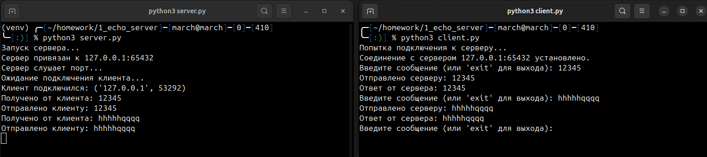

# Отчет по работе "Echo Server"
## Основное задание

1.  Создать простой TCP-сервер, который принимает от клиента строку
    (порциями по 1 КБ) и возвращает ее. (Эхо-сервер).
2.  Сервер должен выводить в консоль служебные сообщения (с пояснениями)
    при наступлении любых событий:
    1.  Запуск сервера;
    2.  Начало прослушивания порта;
    3.  Подключение клиента;
    4.  Прием данных от клиента;
    5.  Отправка данных клиенту;
    6.  Отключение клиента;
    7.  Остановка сервера.
3.  Напишите простой TCP-клиент, который устанавливает соединение с
    сервером, считывает строку со стандартного ввода и посылает его
    серверу.
4.  Клиент должен выводить в консоль служебные сообщения (с пояснениями)
    при наступлении любых событий:
    1.  Соединение с сервером;
    2.  Разрыв соединения с сервером;
    3.  Отправка данных серверу;
    4.  Прием данных от сервера.
## Ход выполнения работы

Создан файл `server.py` - простой эхо-сервер со служебными сообщениями по заданию.

Создан файл `client.py`, который подключается к серверу и обменивается сообщениями.

Запустим сервер и подключим клиент:

### Дополнительное задание 1: Подключение с локальной, виртуальной и удаленной машины

Локальное подключение было продемонстрировано в основном задании.

Подключение с основной системы возможно, если в коде сервера заменить прослушиваемый ip на 0.0.0.0, а в коде клиента заменить адрес на адрес виртуальной машины.

### Дополнительное задание 2: Завершение работы клиента через команду "exit"

Файлы `server.py` и `client.py` модифицированы так, чтобы при вводе клиентом команды `exit`, клиент корректно отключался от сервера и завершал свою работу.

 Проверим работу модификации:

### Дополнительное задание 11: Многопользовательский чат на основе UDP

Файл `server_11.py`:

Файл `client_11.py`:

Запустим сервер и подключим два клиента. Сообщения от каждого клиента видны на втором клиенте:

### Контрольные вопросы 

1. Чем отличаются клиентские и серверные сокеты?
	Серверные сокеты принимают входящие соединения с помощью метода `accept`, создавая для каждого клиента отдельный сокет. Клиентские сокеты инициируют соединение с сервером с помощью `connect`.
	
2. Как можно передавать через сокеты текстовую информацию?
	Текстовые данные преобразуются в байты с помощью методов, например, `.encode('utf-8')`, и передаются через сокет. Полученные байты декодируются с помощью `.decode('utf-8')`.
	
3. Какие операции с сокетами блокируют выполнение программы?
	Операции `accept`, `recv`, и `connect` могут блокировать выполнение программы, если они ожидают завершения.
	
4. Что такое неблокирующие сокеты?
	Неблокирующие сокеты не заставляют программу ждать завершения операций. Для их создания используется метод `setblocking(False)`.
	
5. В чем преимущества и недостатки использования TCP по сравнению с UDP?
	- **TCP:**
	    - Преимущества: Надежная передача, контроль ошибок, порядок доставки.
	    - Недостатки: Более высокая нагрузка на сеть из-за установления соединения и подтверждений.
	    
	- **UDP:**
	    - Преимущества: Быстрее, меньше нагрузки на сеть.
	    - Недостатки: Нет гарантии доставки и порядка.
	    
6. Какие системные вызовы, связанные с сокетами используются только на стороне сервера?
	`bind`, `listen`, `accept`.
	
7. На каком уровне модели OSI работают сокеты?
	Сокеты работают на транспортном уровне (4-й уровень), используя протоколы TCP или UDP.